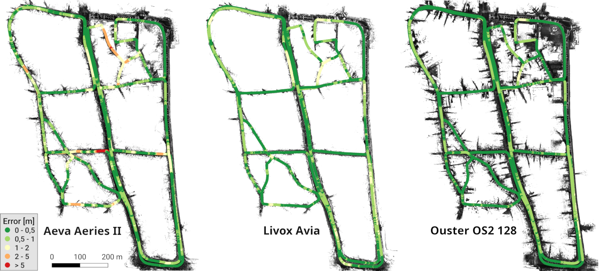
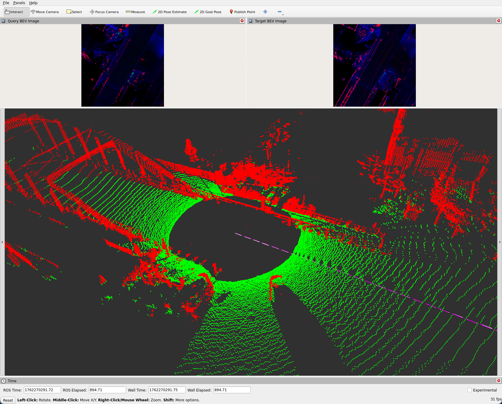

# GroundLoc: Efficient Large-Scale Outdoor LiDAR-Only Localization
This repository contains the source code for the article "GroundLoc: Efficient Large-Scale Outdoor LiDAR-Only Localization" published in the IEEE Robotics and Automation Letters (DOI: [10.1109/LRA.2025.3625518](https://doi.org/10.1109/LRA.2025.3625518), [Arxiv](https://arxiv.org/abs/2510.24623)).
<p align="center">
  
</p>
GroundLoc (R2D2) localization results on the HeLiPR Town sequence using various sensors.

## Videos
[video_aeva_github.webm](https://github.com/user-attachments/assets/c66596a5-ed39-44c8-a698-64c9ff920f4b)
[video_avia_github.webm](https://github.com/user-attachments/assets/38ab7603-ee22-4ddd-ba8d-141565717144)
[video_ouster_github.webm](https://github.com/user-attachments/assets/c1021a2c-2f2b-4987-b32f-4c7b5410a17a)


# Installation
### Docker (Recommended)
Assuming you have Docker installed and the [NVIDIA runtime](https://docs.nvidia.com/datacenter/cloud-native/container-toolkit/latest/install-guide.html) enabled:
```
git clone https://github.com/dcmlr/groundloc.git
cd groundloc
docker build . -t groundloc_docker_image
docker run -it  --net=host --privileged --env="DISPLAY=$DISPLAY" --runtime=nvidia --volume="/tmp/.X11-unix:/tmp/.X11-unix:rw" \
                --volume="/path/to/your/datasets:/var/datasets" --ipc=host --pid=host --gpus all -e=DISPLAY -e=ROS_DOMAIN_ID groundloc_docker_image:latest

```
Without the NVIDIA runtime, you will only be able to run the SIFT version of GroundLoc.

### Alternative: Existing ROS2 Workspace
Assuming you have Ubuntu 24.04, ROS 2 Jazzy, NVIDIA CUDA 12.8, and PyTorch 2.8.0 installed:
```
cd your/ros2/workspace/src
git clone https://github.com/dcmlr/groundloc.git
cd ..
rosdep update
rosdep install -i --from-path src --rosdistro jazzy -y
```
Edit the paths to your CUDA compiler and your PyTorch installation in the ```groundloc/quatro/CMakeLists.txt``` file. Then build your workspace:
```
colcon build
```
# Dataset Organization
### KITTI Dataset
The "dataset_path" parameter should be set to the folder containing the "sequences" directory, as illustrated in the following diagram:
``` 
dataset/
├── poses/
└── sequences/
    ├── 00/
    │   └── velodyne/
    │       ├── 000000.bin
    │       └── ...
    └── ...
```

### HeLiPR Dataset
The "dataset_path" parameter should point to a directory containing the directories for the individual sequences:
```
HeLiPR/
├── Bridge01/
├── Roundabout03/
└── Town03/
```
The structure of the HeLiPR dataset sequences should follow the layout shown [here](https://sites.google.com/view/heliprdataset/system).

# Running
### Localization
This repository contains all models and maps used in our article. Therefore, you can run all localization experiments from the paper "out of the box":
- SemanticKITTI dataset sequences 00 to 10
- HeLiPR dataset sequence Bridge01 using a map created from Bridge04
- HeLiPR dataset sequence Town03 using a map created from Town01 and Town02
- HeLiPR dataset sequence Roundabout03 using a map created from Roundabout01 and Roundabout02

The HeLiPR dataset sequences support the Aeva Aeries II sensor ("Aeva"), the Livox Avia sensor ("Avia"), and the Ouster OS2 128 sensor ("Ouster")

#### Examples
Run the R2D2 localization on KITTI sequence 00:
```
ros2 launch groundloc Localization.launch.py dataset_name:="Kitti" dataset_path:="/var/datasets/path/to/your/Kitti/dataset/folder" sequence="00"
```
Expected output:
```
[...]
[groundgrid_node-5] [INFO] [1761932948.581730767] [groundgrid_node]: Using KITTI parameters
[groundgrid_node-5] Selected dataset type: kitti
[groundgrid_node-5] Using point clouds from: /var/datasets/Kitti/dataset//sequences/00/velodyne/
[groundgrid_node-5] Using poses from: /home/ubuntu/ros/install/groundloc/share/groundloc/res/poses/Kitti/00/00_poses_kitti.txt
[groundgrid_node-5] Acquired utm <-> odom transforms
[quatro_node_cuda-4] [INFO] [1761932948.802770753] [quatro_node_cuda]: Using CUDA for inference
[quatro_node_cuda-4] [INFO] [1761932948.802885362] [quatro_node_cuda]: Loading model /home/ubuntu/ros/install/groundloc/share/groundloc/res/models/kitti360_7eps.pt
[quatro_node_cuda-4] [INFO] [1761932950.968524325] [quatro_node_cuda]: Model warmup...
[quatro_node_cuda-4] [INFO] [1761932951.486925485] [quatro_node_cuda]: Reading map: /home/ubuntu/ros/install/groundloc/share/groundloc/res/maps/Kitti/00.tif
[quatro_node_cuda-4] [INFO] [1761932951.561895107] [quatro_node_cuda]: Initialization complete.
 Cloud 4541 of 4541, avg. freq.: 38.04 Hz, curr. err. xy: 0.04 m, yaw deg.: 0.08°
[INFO] [groundgrid_node-5]: process has finished cleanly [pid 3427386]
```
A file named "result.csv" is created, containing the estimated poses along with the ground-truth poses for convenient comparison.

Run the SIFT localization on KITTI sequence 00:
```
ros2 launch groundloc Localization_SIFT.launch.py dataset_name:="Kitti" dataset_path:="/var/datasets/path/to/your/Kitti/dataset/folder" sequence="00"
```
Run the R2D2 localization on HeLiPR sequence Roundabout03 using the Ouster sensor:
```
ros2 launch groundloc Localization.launch.py dataset_name:="HeLiPR" dataset_path:="/var/datasets/path/to/your/HeLiPR/dataset/folder" sequence:="Roundabout" sensor:="Ouster"
```
- For the Bridge01 or Town03 sequences, replace "Roundabout" with "Bridge" or "Town."
- For the Aeva Aeries II LiDAR or the Livox Avia sensor, replace "Ouster" with "Aeva" or "Avia."
- For the SIFT localization instead of R2D2, replace the Localization.launch.py launch file with Localization_SIFT.launch.py.

### Visualization
The repository contains an RViz2 config for visualization. Launch GroundLoc with a 10 Hz frame-rate limit and the "visualize" flag to enable the live matching view and the debug-image publishers:
```
ros2 launch groundloc Localization.launch.py dataset_name:="HeLiPR" dataset_path:="/var/datasets/path/to/your/HeLiPR/dataset/folder" sequence:="Roundabout" sensor:="Ouster" visualize:="True"  frame_rate_cap:="10.0"
```
Then launch RViz2:
```
rviz2 -d src/groundloc/groundloc/rviz/groundloc.rviz 
```
<p align="center">
  
</p>
RViz2 window using the supplied configuration, showing the segmented point cloud, the query and map BEV images, and the odometry produced by GroundLoc compared with the ground-truth odometry.

# Evaluation of the ATE and ARE metrics
Use the script [calculate_ate_are.py](groundloc/scripts/calculate_ate_are.py) located under [groundloc/groundloc/scripts/](groundloc/scripts/). 
It uses the ATE and ARE calculation logic from KISS-ICP; therefore you need the KISS-ICP Python package installed. The [Dockerfile](Dockerfile) installs it automatically 
into a virtual environment at groundloc/groundloc/scripts/venv/.

### Usage
```
usage: calculate_ate_are [-h] [-p POSES] [-gt GROUND_TRUTH_POSES] [-s SEQUENCE] [-l LIDAR] [-d DATASET]

Calculate ATE and ARE metrics

options:
  -h, --help            show this help message and exit
  -p POSES, --poses POSES
                        path to the pose file
  -gt GROUND_TRUTH_POSES, --ground-truth-poses GROUND_TRUTH_POSES
                        path to the ground-truth pose file. Use this parameter OR the sequence and lidar parameters
  -s SEQUENCE, --sequence SEQUENCE
                        sequence of the dataset to analyze (KITTI: 00, 01, ..., HeLiPR: roundabout, bridge, town)
  -l LIDAR, --lidar LIDAR
                        lidar sensor poses to be used (HeLiPR only: aeva, avia, ouster)
  -d DATASET, --dataset DATASET
                        name of the dataset (kitti, helipr)
```
Use either the ground-truth poses parameter (--gt) with the ground truth poses file or the combination of the sequence (-s) and lidar (-l) parameters.
The dataset parameter is mandatory (either "kitti" or "helipr").

### Examples
Assuming you are using the Docker environment and the current working directory is ~/ros, source the virtual environment by executing:
```
source src/groundloc/groundloc/scripts/venv/bin/activate 
```

Then use the script to calculate the ATE and ARE metrics for your GroundLoc run as shown in the following examples.
Evaluate the ATE and ARE of a run on the KITTI sequence 00:
```
python3 src/groundloc/groundloc/scripts/calculate_ate_are.py  -p result.csv  -s "00" -d "kitti"
ARE: 0.002435  (deg: 0.1395°), ATE: 0.1336 m
```

Evaluate the ATE and ARE of a run on the HeLiPR Roundabout03 sequence using the Ouster sensor:
```
python3 src/groundloc/groundloc/scripts/calculate_ate_are.py  -s "Roundabout" -l "Ouster"  -d "helipr"
ARE: 0.008342  (deg: 0.478°), ATE: 0.4192 m
```


# Advanced Usage
### Map Creation
The [CreateMap.launch.py](groundloc/launch/CreateMap.launch.py) launch file can be used to create prior maps. The maps are saved to "/tmp/map.tif" when the process receives SIGINT (Ctrl+C in the executing terminal).
Two maps can be combined with the [merge_geotiffs.py](groundloc/scripts/merge_geotiffs.py) script. The merging fills empty values of the first map with data from the second.

#### Examples
Create a map from the HeLiPR Bridge04 Aeva Aeries II sequence:
```
ros2 launch groundloc CreateMap.launch.py dataset_name:="helipr" dataset_path:=/var/datasets/HeLiPR/  sequence:="Bridge04" sensor:="Aeva"
```
Merge two maps. Empty cells of map1.tif are filled with data from map2.tif. The third parameter defines the name of the output merged map file.
```
python3 src/groundloc/groundloc/scripts/merge_geotiffs.py map1.tif map2.tif merged_maps.tif
```
### Run GroundLoc as ROS2 node
GroundLoc can also run in "live" mode as a ROS 2 node. In this case, it will subscribe "/point_cloud" topic for the input point cloud and to "/odometry_in" for the odometry produced by KISS-ICP or any other 
odometry source. The corrected odometry is published as "/groundloc/odometry". The transforms between between the sensor and robot frame ("velodyne" <-> "base_link"), and between the local world coordinate 
system frame ("odom") of the odometry poses and the global world coordinate system ("utm") of the prior map must be available. These are defined as static transforms in the launch files. You may need to 
adjust them for your robot.

#### Example
Example using the HeLiPR Avia parameters, model, and map from Bridge04.
```
ros2 launch groundloc Localization.launch.py dataset_name:="live" sensor:="Avia" config_file:="helipr_avia.yaml" model_file:=src/groundloc/groundloc/res/models/avia_finetuned_sejong3_15eps.pt map_file:=src/groundloc/groundloc/res/maps/HeLiPR/Avia/avia_bridge04.tif 
```

### Use a custom PCD dataset
You can also use a custom point cloud dataset consisting of PCD files and pose files in the KITTI format. However, you must adjust the launch files to provide the 
correct transforms between the sensor and robot frames ("velodyne" <-> "base_link") and between the local world coordinate frame ("odom") of the odometry poses 
and the global world coordinate frame ("utm") of the prior map. Additionally, choose the most fitting parameter file for GroundGrid or create a new one. Finally, 
you may adjust the three BEV scaling factors "variance_factor", "normals_factor", and "intensity_factor" for your LiDAR model. These factors are hardcoded in 
[GroundGridNode.cpp](groundgrid/src/GroundGridNode.cpp). 

#### Example
```
ros2 launch groundloc Localization.launch.py dataset_name:="pcd" dataset_path:=path/to/your/pcd/dataset poses_file:=path/to/your/odometry/poses/file 
gt_poses_file:=path/to/optional/groundtruth/poses/file/ sequence:="If your dataset has sequences" sensor:="your_sensor" map_file:=path/to/your/map/file.tif 
config_file:="your_groundgridconfig.yaml"
```

# Citation
If you use our work in your research, please consider citing our article:
```
@ARTICLE{groundloc2025,
  author={Steinke, Nicolai and Goehring, Daniel},
  journal={IEEE Robotics and Automation Letters}, 
  title={GroundLoc: Efficient Large-Scale Outdoor LiDAR-Only Localization}, 
  year={2025},
  volume={},
  number={},
  pages={1-8},
  keywords={Location awareness;Sensors;Laser radar;Sensor systems;Point cloud compression;Mobile robots;Global navigation satellite system;Odometry;Simultaneous localization and mapping;Pipelines;Range Sensing;Mapping;Localization},
  doi={10.1109/LRA.2025.3625518}}
```

# License
GroundLoc is licensed under the [CC BY-NC-SA 4.0 license](http://creativecommons.org/licenses/by-nc-sa/4.0/).

# Acknowledgements
This work builds upon other researchers' work - specifically, [Quatro](https://quatro-plusplus.github.io), [R2D2](https://github.com/naver/r2d2), and [KISS-ICP](https://github.com/PRBonn/kiss-icp). If you use GroundLoc in your academic work, please also consider citing their respective publications.

The research leading to these results received funding from the KIS'M project (FKZ: 45AVF3001F), funded by the German Federal Ministry for Digital and Transport (BMDV) program "A future-proof, sustainable mobility system through automated driving and networking."
